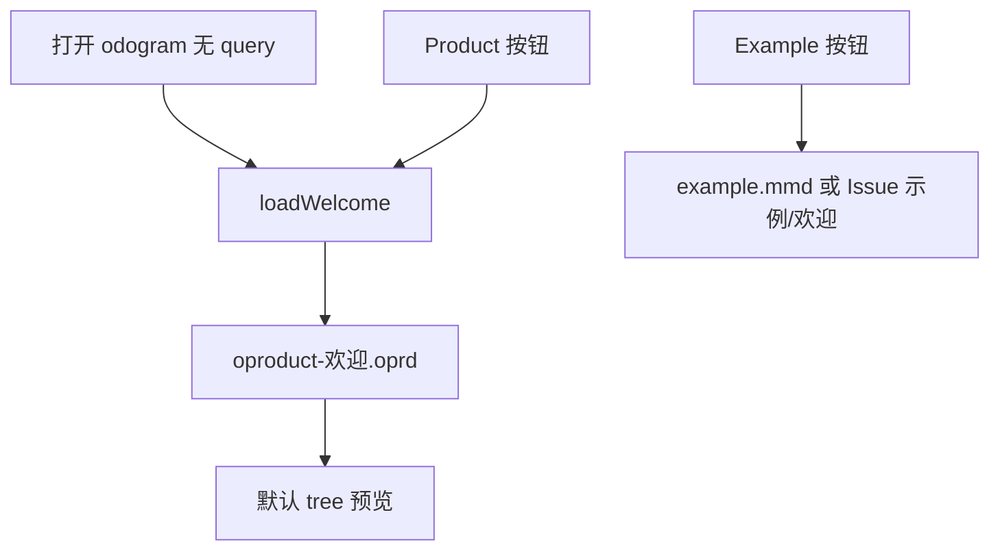

# odogram 产品构成图（oproduct）

## 目标

用已实现的 **oproduct DSL** 做 odogram 的「产品说明书」：一份源码同时呈现 **能力树 / 路线图 / 用户旅程**。按你的选择：**首次进入默认展示产品图**，Mermaid 欢迎流程图改由 **Example** 按钮加载。

---

## 内容结构（将写入 [`public/diagrams/oproduct-欢迎.oprd`](public/diagrams/oproduct-欢迎.oprd)）

### Frontmatter

```yaml
---
format: oproduct
view: tree
title: odogram — 产品构成与能力地图
---
```

### Tree 视图（6 个模块，覆盖已实现能力）

| 模块 | 功能点（示例） | 状态 |
|------|----------------|------|
| **产品定位** | Cursor 风格 Mermaid 编辑器；图存在用户 GitHub Issue；站点只做编辑与分享 | done |
| **编辑器** | CodeMirror 源码编辑、撤销/重做、2s 自动保存、Layout dagre/elk | done |
| **Mermaid 预览** | 实时渲染、viewBox 矢量缩放、滚轮缩放/右键中键平移/左键拾取、双击或 Enter 改标签回写源码 | done |
| **工作模式** | Edit 分屏 / Focus 预览独占 / Result 底栏源码；移动端 Source/Preview Tab | done |
| **oproduct 格式** | tree / roadmap / journey 三视图；Product 工具栏入口 | done |
| **存储与账号** | GitHub OAuth、Issue 持久化（label `odogram:diagram`）、文件夹+id、侧栏重命名/复制/移动/删除、旧 .mmd 迁移 | done |
| **分享与导出** | 公开 `/view/:user/:folder/:id`、复制源码、Mermaid SVG 下载 | done |

（模块 6–7 可拆为「存储与账号」「分享与导出」两个 module，避免单模块过长。）

### Roadmap 视图（与现有计划对齐）

```oproduct
@view roadmap
milestone 已完成-P1
  deliver Issue 存储与自动保存 [done]
  deliver 预览交互与标签编辑 [done]
  deliver oproduct 多视图 DSL [done]

milestone P1.5
  deliver oproduct 预览内选中与回写 [plan]
  deliver 粘贴后提示切换 Result 模式 [plan]

milestone P2
  deliver URL 无登录压缩分享 [plan]
  deliver Present 演示模式 [plan]
  deliver 协作评论与模板库 [plan]
```

### Journey 视图（4 条 persona）

| Persona | 步骤链 |
|---------|--------|
| **访客** | 打开站点 → 默认看到产品构成图（tree）→ 点 Example 加载 Mermaid 教程 |
| **新用户** | GitHub 登录 → 编辑并自动保存到 Issue → 侧栏管理图表 |
| **深度编辑** | 写 Mermaid 源码 → Focus 模式在预览中思考 → 双击改标签同步源码 |
| **分享收件人** | 打开 `/view/...` → 只读 Mermaid 或 oproduct 预览 |

---

## 代码改动（最小范围）

### 1. 重写 [`public/diagrams/oproduct-欢迎.oprd`](public/diagrams/oproduct-欢迎.oprd)

- 按上文补全 tree / roadmap / journey 正文
- 保持现有 DSL 语法（`@view`、`module`、`feature [status]`、`milestone`、`deliver`、`persona`、`step A -> B`）
- 不新增 parser 能力

### 2. 默认入口改为产品图 — [`public/diagrams.js`](public/diagrams.js) + [`public/app.js`](public/app.js)

当前逻辑（无 `?id=` 时）：

```js
await diagramApi.loadExample();  // 加载 Mermaid
```

改为：

```js
await diagramApi.loadWelcome();  // 新建：内部调用 loadStaticProductExample()
```

- **`loadWelcome()`**：始终 `fetch('/diagrams/oproduct-欢迎.oprd')`，不写入 GitHub（与现 `loadStaticProductExample` 相同，可合并命名）
- **`loadExample()`**（Example 按钮）：仅加载 Mermaid
  - 未登录：`loadStaticExample()` → `example.mmd`
  - 已登录：保留现有 `示例/欢迎` Issue 打开/种子逻辑，种子源仍为 [`example.mmd`](public/diagrams/example.mmd)（**不**用 oproduct 覆盖已有 Issue）

### 3. 工具栏文案微调 — [`public/index.html`](public/index.html)

| 按钮 | 建议 title |
|------|------------|
| Example | Load Mermaid tutorial / 加载 Mermaid 教程 |
| Product | Reload product map / 重新加载产品构成图 |

（Product 按钮可改为调用 `loadWelcome()`，与首次进入一致。）

### 4. 不改动

- oproduct parser / 渲染器 / 分享页逻辑（已实现）
- `示例/欢迎` Issue 种子策略：**仅 Example 按钮触发**，默认首页不自动创建 Issue
- README（可选后续同步 Issue 存储说明，本次不强制）

---

## 数据流



---

## 验证清单

1. 未登录打开 `/` → 默认 oproduct 产品图，tree 视图有 6+ 模块
2. Tree / Roadmap / Journey 切换正常
3. 点 **Example** → 切换为 Mermaid 双语 flowchart，Layout 显示
4. 点 **Product** → 回到 oproduct 产品图
5. 已登录无 `?id=` → 同样默认产品图（不自动 seed Issue）
6. 已登录点 Example → 行为与现网一致（打开或种子 `示例/欢迎`）
