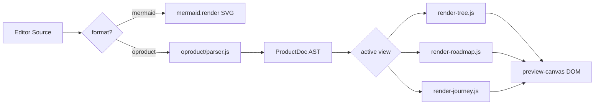

# oproduct 多视图 DSL（tree / roadmap / journey）

## 目标

在 Mermaid 之外增加 **`oproduct` 格式**：用一份文本表达**产品功能**，预览支持三种视图：

| 视图 | 表达内容 | 典型用途 |
|------|----------|----------|
| **tree** | 模块 → 功能清单 + 状态 | PRD、能力地图 |
| **roadmap** | 版本/里程碑 → 交付项 | 排期、版本规划 |
| **journey** | 角色 → 步骤 → 触点功能 | 用户旅程 |

与现有 Mermaid **共存**：通过 frontmatter `format:` 分流渲染器；Issue 存储、自动保存、分享页链路不变。

---

## 格式约定（v0 DSL）

### Frontmatter（复用现有 `---` 块）

```yaml
---
format: oproduct
view: tree
title: odogram 功能地图
folder: "示例"
---
```

- `format: oproduct` — 启用 oproduct 渲染器
- `view` — 默认预览视图（`tree` | `roadmap` | `journey`）
- 其余 `folder` 等字段与 [`src/frontmatter.js`](src/frontmatter.js) 兼容

### Body 语法（缩进块，类似 YAML-lite）

```oproduct
@view tree
module 编辑器
  feature 三种工作模式 [done]
  feature 预览交互 [done]

module 存储
  feature Issue 持久化 [done]

@view roadmap
milestone Q2-2026
  deliver URL无登录分享 [plan]
  deliver Present演示模式 [plan]

@view journey
persona 新用户
  step 打开站点 -> 浏览示例
  step GitHub登录 -> 自动保存
  step 分享链接 -> 只读预览
```

**词法规则（MVP）**：

- `@view tree|roadmap|journey` — 切换后续块所属视图（也可只在 frontmatter 设默认 view）
- `module <name>` + 缩进 `feature <text> [status]` — tree；status：`done|plan|deprecated`（默认 `plan`）
- `milestone <id>` + 缩进 `deliver <text> [status]` — roadmap
- `persona <name>` + 缩进 `step A -> B` — journey（`->` 右侧为触点/功能说明）
- `#` 行注释；空行忽略
- 解析失败 → 预览区显示行号错误（与 mermaid error 一致）

---

## 架构



**与现有 preview 的关系**：

- [`public/preview.js`](public/preview.js) 的 `renderPreview()` 变为**路由器**：
  1. `parseFormat(code)` → `mermaid` | `oproduct`
  2. mermaid：现有逻辑（viewBox、selection、label-edit **保持**）
  3. oproduct：调用 `renderOproductPreview()`，**禁用** mermaid 专用交互（zoom/viewBox 可保留为 DOM 缩放或 MVP 用 CSS scroll + fit）

---

## 新建文件

| 文件 | 职责 |
|------|------|
| [`public/oproduct/parser.js`](public/oproduct/parser.js) | 解析 frontmatter + body → `{ title, defaultView, views: { tree, roadmap, journey } }` |
| [`public/oproduct/model.js`](public/oproduct/model.js) | AST 类型常量、status 枚举 |
| [`public/oproduct/render-tree.js`](public/oproduct/render-tree.js) | 模块树 + 状态 pill DOM |
| [`public/oproduct/render-roadmap.js`](public/oproduct/render-roadmap.js) | 里程碑时间轴式 DOM |
| [`public/oproduct/render-journey.js`](public/oproduct/render-journey.js) | persona 步骤链 DOM |
| [`public/oproduct-preview.js`](public/oproduct-preview.js) | 编排：parse → 当前 view → mount；视图切换 UI；detach 清理 |
| [`public/oproduct/example.oprd`](public/oproduct/example.oprd) 或 [`public/diagrams/oproduct-example.oprd`](public/diagrams/oproduct-example.oprd) | 示例（加载路径见下） |

**共享 format 检测**（避免重复）：

- [`public/format.js`](public/format.js) — `parseDiagramFormat(code)` 读 frontmatter `format`，默认 `mermaid`

---

## 修改现有文件

### [`public/preview.js`](public/preview.js)

```js
import { parseDiagramFormat } from './format.js';
import { renderOproductPreview, detachOproductPreview } from './oproduct-preview.js';

async function renderPreview() {
  const code = ctx.editor.getValue().trim();
  const format = parseDiagramFormat(code);
  if (format === 'oproduct') {
    detachPreviewInteraction(getPreviewSvg());
    renderOproductPreview({ code, container: previewCanvas, previewEl: preview, ... });
    setPreviewInteractionsEnabled(true); // 或 oproduct 专用 zoom 策略
    return;
  }
  detachOproductPreview();
  // 现有 mermaid 路径...
}
```

- oproduct 模式下 **不** 调用 `mermaid.render`
- `ctx.lastSvg` 对 oproduct 可存空或序列化 HTML snapshot（Download SVG MVP：**暂禁用**或提示「仅 Mermaid 图可导出 SVG」）

### [`public/app.js`](public/app.js) + [`public/index.html`](public/index.html)

- 当 `format === oproduct` 时：
  - **隐藏** Layout 下拉（[`layout-ui.js`](public/layout-ui.js) / toolbar）
  - 预览头显示 **Tree | Roadmap | Journey** 视图切换（与 workbench Edit/Focus/Result **并列**，仅 oproduct 可见）
- 视图偏好：`localStorage` `odogram-oproduct-view`；与 frontmatter `view` 默认合并

### [`src/frontmatter.js`](src/frontmatter.js) + [`src/worker.js`](src/worker.js)

- `parseFrontmatter` 增加 `format`、`view`、`title` 字段（服务端分享页用）
- [`viewPageHtml`](src/worker.js) 分支：
  - `format === oproduct` → 加载 `public/view-oproduct.js`（薄封装：import parser + render，无编辑器）
  - 否则 → 现有 mermaid 内联脚本

新建 [`public/view-oproduct.js`](public/view-oproduct.js)（~30 行 module，供 `/view/` 只读页）

### [`public/style.css`](public/style.css)

- `.oproduct-preview`、`.oproduct-tree`、`.oproduct-roadmap`、`.oproduct-journey`
- 状态色：`done` / `plan` / `deprecated` 用 CSS 变量（暗色主题一致）
- 选中/拾取：**P2**；MVP 只读无 selection 冲突

### 示例入口

- 新增静态示例 `public/diagrams/oproduct-欢迎.oprd`
- 未登录：`loadExample` 仍走 mermaid；toolbar **Example** 可轮换或新增「Product map」按钮（MVP：第二个 example 按钮或 Example 下拉 — **建议** toolbar 增加 `Product` 示例按钮，加载 oproduct 示例）

---

## MVP 范围（P1）

**做：**

- DSL 解析 + 三视图只读 DOM 渲染
- 编辑器/分享页 format 分流
- 预览头视图切换 + localStorage 记忆
- oproduct 示例 + Product 示例加载按钮
- 解析错误提示

**不做（P2）：**

- 左键拾取 / Enter 编辑回写源码（需 `oproduct-patcher.js`）
- Present 第四视图
- oproduct → 导出 SVG
- Agent 自动 `format: oproduct` 检测提示

---

## 三视图 UI 草图

**tree**：左栏 module 列表，右栏 feature 卡片网格（status 色条）

**roadmap**：垂直 milestone 轴，每项下 deliver 列表（类似简化 gantt 只读）

**journey**：persona tab/列，步骤为水平/垂直 stepper（`step 文案 -> 触点`）

共用 preview 容器 `#preview-canvas`，根节点 `div.oproduct-preview`。

---

## 验证清单

1. `format: oproduct` 文档：三视图切换正常，刷新保留 view
2. 普通 mermaid 文档：行为与现网一致（layout、zoom、selection、label-edit）
3. 语法错误：行号 + 消息
4. `/view/user/id` 分享页：oproduct 与 mermaid 均能只读渲染
5. 自动保存：oproduct 源码写入 Issue 无回归
6. Layout 控件在 oproduct 下隐藏

---

## 分期

| 阶段 | 内容 |
|------|------|
| **P1** | parser + 三视图 + preview 路由 + 分享页 + 示例 |
| **P1.5** | 左键选中 feature/milestone/step；Enter 改文案回写 DSL |
| **P2** | `@view present`；oproduct → PNG；粘贴检测提示切 Product 示例 |
