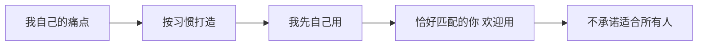

# odogram 产品定位 — 文字表达稿

**本阶段范围**：只写文字，**不修改**任何仓库文件。确认文案后再决定是否落地到 [`public/diagrams/oproduct-欢迎.oprd`](public/diagrams/oproduct-欢迎.oprd)、README、UI 等。

---

## 1. 定位哲学（一句话 → 一段）

### 一句话

**odogram 是我为自己做的 Mermaid 与产品图编辑器；若你也恰好需要同样的东西，欢迎拿来用。**

### 展开版（约 80 字，适合 README 开头 / 产品图首屏）

> 我做 odogram，不是因为市场上缺一个「通用在线画图工具」，而是我自己在写架构图、整理产品思路时反复撞墙：工具不顺手、图散落各处、数据不想交给别人托管。  
> 于是按自己的习惯搭了这套编辑器。它优先服务我的 workflow，不承诺讨好所有人。  
> **若其中某些功能恰好也适合你，欢迎一起用。**

### 英文对照（可选，与现有双语风格一致）

> odogram is a Mermaid and product-map editor I built for **my own** workflow—not a generic diagram SaaS.  
> If what you need happens to overlap, you're welcome to use it.

---

## 2. 核心叙事结构

从「对外推销」改为「自述 + 开放邀请」：



**语气原则**

| 避免 | 改为 |
|------|------|
| 「最好的 Mermaid 编辑器」 | 「我日常在用的编辑器」 |
| 「为开发者/团队打造」 | 「为我自己的习惯打造」 |
| 「立即注册体验」 | 「若你也需要，登录 GitHub 即可保存」 |
| 功能清单式推销 | 先讲为什么做，再列能力 |

---

## 3. 「我自己的问题与困难」（痛点清单 — 草稿）

以下从 odogram **已有设计决策反推**，你可逐条删改；它们支撑「为自己量身打造」的可信度。

| 痛点 | 我遇到的困难 | odogram 的应对 |
|------|--------------|----------------|
| **图的数据归谁** | 在线工具存图在平台账号里，迁移、备份、长期持有都不踏实 | 图存在 **我自己的 GitHub Issue**，站点只做编辑与分享 |
| **编辑体验** | 现有在线 Mermaid 像「表单 + 预览」，不像在 IDE 里思考 | **Cursor 风格**分屏、暗色、撤销/自动保存 |
| **预览即思考** | 改节点文案要在源码和预览间来回找 | **Focus 模式**、预览内拾取/改标签回写源码 |
| **产品文档分散** | 能力树、路线图、用户旅程各写各的，改一处漏一处 | **oproduct** 一份源码，tree / roadmap / journey 三视图 |
| **分享要轻** | 不想为发一张图搭后端或注册新 SaaS | 公开 `/view/...` 链接，Worker 按需读 GitHub |
| **部署可控** | 希望工具可自托管、不绑死某家存储 | Cloudflare Worker + 静态前端，无服务端存图 |

**精简版（oproduct tree 模块用，3 条）**

- 图要在我自己的 GitHub 里，而不是别人的数据库  
- 编辑要像在 Cursor 里写代码，而不是填网页表单  
- 产品思路要能一份源码讲清 tree / roadmap / journey  

---

## 4. oproduct 三视图 — 改写文案稿

> 以下为**可直接粘贴**的 oproduct 正文草案（语法与现网一致）。落地时替换 [`oproduct-欢迎.oprd`](public/diagrams/oproduct-欢迎.oprd) 对应段落即可。

### 4.1 Frontmatter title 建议

```yaml
title: odogram — 为自己做的编辑器（恰好也欢迎你）
```

### 4.2 Tree 视图 — 将 `module 产品定位` 改为 `module 为什么做`

```oproduct
@view tree
module 为什么做
  feature 图要在我自己的 GitHub Issue 里而不是平台数据库 [done]
  feature 编辑要像 Cursor 分屏写代码而不是网页表单 [done]
  feature 产品 tree roadmap journey 想一份源码讲清 [done]
  feature 若你也恰好需要同样的东西 欢迎用 不承诺适合所有人 [done]

module 编辑器
  feature CodeMirror 源码编辑语法高亮 [done]
  ...（其余模块保持能力描述不变，不必每句加「为我」）
```

**说明**：除首模块外，功能模块仍用中性能力描述（「撤销与重做」而非「我需要的撤销」），避免全文重复「我」字；**定位只集中在 `为什么做` 模块**。

### 4.3 Roadmap 视图 — 加一句 milestone 说明（可选）

在第一个 milestone 前增加静态说明（若 parser 不支持纯文本段，可写入第一个 deliver 的文案）：

```oproduct
@view roadmap
milestone 定位
  deliver 先满足作者自己的 workflow 再考虑通用化 [done]

milestone 已完成-P1
  deliver Issue 存储与 2s 自动保存 [done]
  ...
```

或保持 roadmap 纯交付项，**不在 roadmap 重复哲学**（更干净）。

### 4.4 Journey 视图 — 重写 persona

```oproduct
@view journey
persona 作者本人
  step 写架构图或产品图 -> 在 Edit 或 Focus 模式里改
  step 需要版本与备份 -> 自动保存到自己的 GitHub Issue
  step 要给别人看 -> 发 /view 链接

persona 访客
  step 打开 odogram -> 先看这份产品构成图 了解为什么做
  step 觉得恰好匹配 -> 登录 GitHub 开始用
  step 觉得不匹配 -> 仍可看 Example 教程或只读分享页

persona 恰好匹配的你
  step GitHub 登录 -> 图表存进你自己的 odogram-diagrams
  step 编辑与自动保存 -> 与作者相同的 workflow
  step 分享链接 -> 收件人无需登录

persona 分享收件人
  step 打开 /view/... -> 只读预览
  step 无需注册 -> 看完即走
```

**变化要点**：新增 `作者本人`；`新用户` 改为 `恰好匹配的你`；`访客` 增加「不匹配也可以只看」的出口，体现不推销。

---

## 5. 其它触点 — 预备文案（本阶段不改文件）

| 位置 | 现文案倾向 | 建议改写 |
|------|------------|----------|
| [`README.md`](README.md) 首段 | Cursor-style Mermaid editor for everyone | 见 §1 展开版 |
| [`index.html`](public/index.html) `<title>` | odogram — Mermaid Editor | odogram — 为自己做的 Mermaid 编辑器 |
| [`example.mmd`](public/diagrams/example.mmd) intro 节点 | Cursor-style Mermaid Editor | odogram — 作者自用的 Mermaid 编辑器<br/>若你也需要，欢迎用 |
| [`guest-catalog.js`](public/diagrams/guest-catalog.js) label | 产品构成图 | 为什么做 odogram（产品构成图） |
| [`auth-ui.js`](public/auth-ui.js) 未登录 hint | 请先 Login… | 登录后图会存进**你自己的** GitHub；odogram 不存你的 diagram |

---

## 6. 边界说明（文字里要不要写）

建议在「为什么做」或 README 加一句**诚实边界**，与「欢迎你」不矛盾：

> 这不是团队协作文档、不是 Notion 替代品、不是「人人适用的画图 SaaS」。  
> 协作、模板库、演示模式等排在 roadmap 里，是因为**我**将来可能需要，不是对外的功能承诺。

---

## 7. 下一步（需你确认后再做）

1. **你审阅 §3 痛点清单**：删、改、补真实经历（比反推更有说服力）  
2. **选定语气**：偏克制（少「我」）还是偏个人博客（多第一人称）  
3. **确认是否改 Journey 的 persona 命名**（「恰好匹配的你」是否太长）  
4. **文案定稿后**，再单独开一轮：只改 [`oproduct-欢迎.oprd`](public/diagrams/oproduct-欢迎.oprd)，或连同 README / UI 一并统一

---

## 交付物摘要

本计划已包含可直接使用的：

- 一句话 + 展开版定位  
- 痛点表格 + oproduct tree 首模块草案  
- Journey persona 重写稿  
- 其它触点预备文案表  

**当前不执行任何文件修改。**
