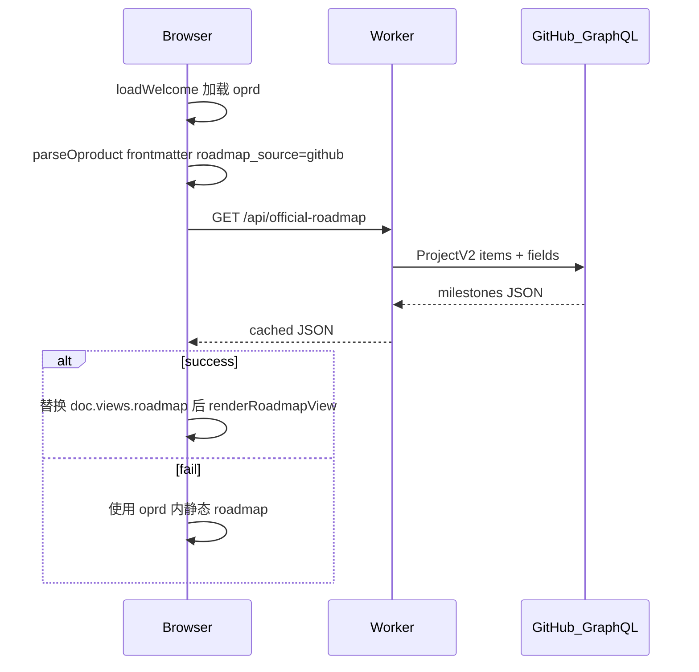

# 官方产品图 Roadmap ← GitHub Project（Phase A）

## 目标用户故事

- **US-1**：访客打开默认产品图，Roadmap 显示 GitHub Project 里的真实状态
- **US-14**：Project API 失败或未配置时，仍显示 [`public/diagrams/oproduct-欢迎.oprd`](public/diagrams/oproduct-欢迎.oprd) 内手写 `milestone`/`deliver`
- **US-15**：Tree / Journey 继续用静态 DSL，**仅 Roadmap 视图**走 GitHub 数据源

## 架构



**关键决策**：访客可见的拉取走 **Worker 服务端 Token**（`GITHUB_OFFICIAL_TOKEN`，scope `read:project`），**不扩展用户 OAuth**（[`src/auth.js`](src/auth.js) 仍保持 `public_repo`）。

## 数据隔离：会不会影响图表 Issue？

**结论：不会影响用户图表存储，也不会改写任何 Issue。**

| 数据 | 存放位置 | 与官方 Project 的关系 |
|------|----------|----------------------|
| 用户图表 | 各用户自己的 `{username}/odogram-diagrams` Issue，label `odogram:diagram` | **完全隔离**。官方 Project 在 odogram 源码仓/组织下，API 只读指定 Project，不会访问用户 diagram 仓库 |
| 官方路线图 | 维护者指定的 **独立 Project**（建议挂在 `odogram` 源码仓，而非 `odogram-diagrams`） | **只读拉取** Project 卡片 → 渲染 Roadmap；不 create/update/close Issue |

Phase A **没有任何写操作**：不往 Project 加卡片、不改 Issue 状态、不碰 `saveDiagram` / `createIssue` 流程。

### 仍需注意的「同仓混用」风险

若官方 Project 挂在 **odogram 源码仓** 且开启了「新 Issue 自动进 Project」，那么 **bug、PR、杂项 Issue** 可能被收进看板。为避免它们出现在产品 Roadmap 上，计划采用 **白名单过滤**（在 [`src/github-projects.js`](src/github-projects.js) 实现）：

1. **推荐（维护成本最低）**：Roadmap 卡片用 **Draft Issue**（Project 内草稿），不关联源码仓真实 Issue → 与图表/业务 Issue 零交叉
2. **备选**：仅纳入带 label **`odogram:roadmap`** 的 Issue 卡片
3. **防御性排除**：跳过 label 含 **`odogram:diagram`** 的项（即使用户 diagram 仓不可能出现在此 Project，仍作硬过滤）

未通过白名单的 Project 卡片 **静默忽略**，不报错、不展示。

### 推荐维护者工作流

```
odogram 源码仓（odoka/odogram）
  └── Project「odogram Roadmap」     ← 仅 Phase A 读取此 Project
        ├── Draft: P1.5 预览内回写   ← 推荐用草稿，不污染 Issues 列表
        ├── Draft: Present 演示模式
        └── （可选）链接 odogram:roadmap 标签的 Feature Issue

用户 odogram-diagrams 仓（各用户私有）
  └── Issue label odogram:diagram    ← 图表存储，本功能完全不碰
```

## 配置（维护者一次性设置）

在 [`wrangler.jsonc`](wrangler.jsonc) 增加非敏感 vars（示例）：

```jsonc
"OFFICIAL_PROJECT_OWNER": "your-github-login",
"OFFICIAL_PROJECT_NUMBER": "1"
```

在 wrangler / `.dev.vars` 增加 secret：

```env
GITHUB_OFFICIAL_TOKEN=ghp_...   # read:project，仅需读官方 Project
```

维护者在 GitHub 上：
1. 在 **odogram 源码仓**（非 `odogram-diagrams`）建独立 **Project v2**，命名如 `odogram Roadmap`
2. **不要**把此 Project 与用户图表仓关联；关闭「自动把所有新 Issue 加入此 Project」（若已开启，依赖下方白名单过滤兜底）
3. 使用标准字段：**Status**（Todo / In Progress / Done）、**Iteration**（映射 milestone，如 `P1.5`、`P2`）
4. 卡片优先用 **Draft Issue** 填写 deliver 文案；若关联真实 Issue，须打 label `odogram:roadmap`

未配置 token 或 project 时，API 返回 `{ enabled: false }`，前端静默回退静态 DSL。

## 后端实现

### 1. 新建 [`src/github-projects.js`](src/github-projects.js)

复用 [`src/github-graphql.js`](src/github-graphql.js) 的 fetch 模式，新增：

- `fetchOfficialRoadmap(env)` → `{ enabled, projectUrl?, milestones: [{ id, delivers: [{ text, status, url? }] }] }`
- GraphQL 查询 `user(login).projectV2(number)` 或 `organization(login).projectV2(number)`（owner 类型可配置或自动探测）
- 分页拉取 `items`（`first: 100` + cursor，MVP 足够）
- **字段映射**（MVP 按字段名匹配，大小写不敏感）：
  - `Iteration` / `迭代` → `milestone.id`
  - `Title` / 卡片标题 → `deliver.text`
  - `Status`：`Done`→`done`，`In Progress`→`plan`（渲染层可加 `in-progress` 样式），`Todo`→`plan`
  - 无 Iteration 的项归入 `Backlog` milestone
- **白名单过滤**（见上文「数据隔离」）：
  - `DraftIssue` → 始终纳入
  - `Issue` → 仅当 labels 含 `odogram:roadmap` 时纳入；含 `odogram:diagram` 时跳过
- 关联 Issue 时附带 `url` 供 Roadmap 渲染「在 GitHub 打开」链接

### 2. 扩展 [`src/worker.js`](src/worker.js)

新增路由：

```
GET /api/official-roadmap
```

- 无需 session
- 使用 `Cache API` 或 `caches.default` 缓存 **5 分钟**（`Cache-Control: public, max-age=300`），减轻 GitHub 限流
- 错误时返回 `{ enabled: true, error: "...", milestones: null }` 或 HTTP 200 + fallback 标记，避免前端抛异常

## 前端实现

### 3. Frontmatter 标记 — [`public/diagrams/oproduct-欢迎.oprd`](public/diagrams/oproduct-欢迎.oprd)

在现有 frontmatter 增加一行（不删静态 roadmap 正文，作后备）：

```yaml
roadmap_source: github
```

### 4. 解析 frontmatter — [`public/format.js`](public/format.js) 或 [`public/oproduct/parser.js`](public/oproduct/parser.js)

解析 `roadmap_source` 到 doc 元数据（`github` | 缺省则纯静态）。

### 5. 异步注水 Roadmap — [`public/oproduct-preview.js`](public/oproduct-preview.js)

在 `renderOproductPreview` 中：

1. 照常 `parseOproductDocument` + 渲染 Tree/Journey
2. 若 `roadmap_source === 'github'`：
   - 先渲染 Roadmap（可用静态数据或 loading skeleton）
   - `fetch('/api/official-roadmap')` 成功后 **浅替换** `activeDoc.views.roadmap.milestones`
   - 若当前视图为 roadmap，调用 `renderRoadmapView` 刷新
3. fetch 失败：`console.warn` + 保留 oprd 内静态 milestones（US-14）

导出小函数 `hydrateOfficialRoadmap(doc)` 供分享页复用。

### 6. Roadmap 渲染增强 — [`public/oproduct/render-roadmap.js`](public/oproduct/render-roadmap.js)

- 可选：deliver 有 `url` 时渲染为外链
- 可选：header 下增加 `Synced from GitHub Project` + 项目链接（来自 API `projectUrl`）
- `In Progress` 可用现有 `status-plan` 或新增 `status-progress` CSS（仅渲染层，不改 DSL parser）

### 7. 分享页 — [`public/view-oproduct.js`](public/view-oproduct.js)

与编辑器相同：检测 `roadmap_source: github` 后调用 `hydrateOfficialRoadmap`，保证 `/view/...` 只读页 Roadmap 也是活的。

## 不改动（本阶段范围外）

- 用户 OAuth scope（`read:project` / `project`）
- 用户绑定自己的 Project（Phase B）
- deliver 创建/回写 Issue
- oproduct parser 新语法（`milestone`/`deliver` 仍仅用于静态后备）
- 修改 plan 文件本身

## 验证清单

1. **未配置** `GITHUB_OFFICIAL_TOKEN` → Roadmap 显示 oprd 静态内容，无报错
2. **已配置** + 有效 Project → Roadmap 显示 Project 卡片，按 Iteration 分组
7. Project 内混入无 `odogram:roadmap` 标签的普通 Issue → **不显示**；Draft 卡片正常显示；用户 `odogram-diagrams` 仓不受影响
3. Project API 模拟失败（错误 token）→ 回退静态 DSL
4. Tree / Journey 不受 fetch 影响
5. Example / Product 切换后，产品图 Roadmap 仍能注水
6. 分享页（若未来有公开 oproduct 链接）Roadmap 同步行为一致

## 文档

在 [`README.md`](README.md) 增加简短 **「Official roadmap (GitHub Project)」** 小节：如何建 Project、字段约定、wrangler secret 设置。
