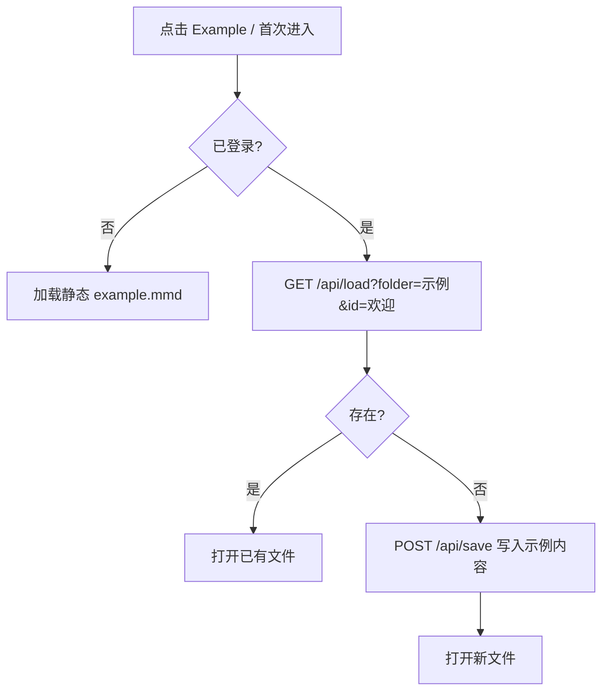

# 文件夹分组 + 示例种子化

## 目标行为

| 场景 | 行为 |
|------|------|
| 未登录 | 仍从静态 [`public/diagrams/example.mmd`](public/diagrams/example.mmd) 加载到编辑器（不写入 GitHub） |
| 已登录 + `示例/欢迎` 不存在 | 用 bundled 示例内容 **创建** 到 GitHub，再打开 |
| 已登录 + `示例/欢迎` 已存在 | **仅加载**，不覆盖内容 |
| 旧用户根目录 `diagrams/foo.mmd` | 侧栏显示在「未分组」，API 兼容 `folder: ""` |



## 1. 存储与路径模型

**常量**（[`public/app-context.js`](public/app-context.js)）：

```javascript
export const EXAMPLE_FOLDER = '示例';
export const EXAMPLE_ID = '欢迎';
export const ROOT_FOLDER = ''; // 根目录 / 未分组
```

**[`src/github.js`](src/github.js)** 核心改动：

- `filePath(folder, id)` → `diagrams/{folder}/{id}.mmd` 或 `diagrams/{id}.mmd`（`folder` 为空）
- `listDiagrams` 改用 Git Trees API（`recursive=1`）扫描 `diagrams/**/*.mmd`，返回 `{ id, folder, path, url }`
- `saveDiagram` / `loadDiagram` / `deleteDiagram` / `renameDiagram` / `fetchPublicDiagram` / `getShareUrl` / `getGitHubFileUrl` 均增加 `folder` 参数
- `renameDiagram` MVP 仅支持**同文件夹内**改名；移动走新接口

**新接口** `POST /api/move`（[`src/worker.js`](src/worker.js)）：

- body: `{ id, fromFolder, toFolder }`
- 实现：读旧路径 → 写新路径 → 删旧文件（与 rename 类似）

**分享 URL** 扩展为：

- 有文件夹：`/view/:username/:folder/:id`
- 根目录：`/view/:username/:id`（保持向后兼容）

[`handleView`](src/worker.js) 解析 3 段（根）或 4 段（含 folder）路径。

## 2. API 契约更新

| 端点 | 变更 |
|------|------|
| `GET /api/list` | 返回 `diagrams[].folder` |
| `GET /api/load` | 查询参数 `id` + 可选 `folder` |
| `POST /api/save` | body 增加可选 `folder` |
| `POST /api/delete` | body 增加可选 `folder` |
| `POST /api/rename` | body 增加 `folder`（同目录改名） |
| `POST /api/move` | 新增，跨文件夹移动 |

## 3. 前端状态与 URL

**[`public/app-context.js`](public/app-context.js)**：`ctx.currentFolder = ''`

**[`public/app.js`](public/app.js)** URL 参数：

- `?folder=示例&id=欢迎`（`setQueryDiagram(folder, id)` / `getQueryDiagram()`）
- 初始化：有 query 则 `loadDiagram(id, folder)`，否则 `loadExample()`

**图表唯一键**：`diagramKey(folder, id)` → `folder ? folder/id : id`；[`name-dialog.js`](public/name-dialog.js) 的 `ctx.diagramIds` 与 `isDiagramIdTaken` 改为按 **当前 folder** 判断冲突（同 folder 内 id 不可重复，不同 folder 可同名）。

## 4. `loadExample` 重写

**[`public/diagrams.js`](public/diagrams.js)**：

```javascript
async function loadExample() {
  await flushAutoSave();
  if (!ctx.user?.login) {
    // 现有静态加载逻辑
    return;
  }
  const folder = EXAMPLE_FOLDER;
  const id = EXAMPLE_ID;
  let loaded = await tryLoadDiagram(id, folder);
  if (!loaded) {
    const code = await fetch('/diagrams/example.mmd').then(r => r.text());
    await saveDiagramWithId(id, { folder, code, quiet: true }); // 需扩展 save 支持传入 code
    loaded = await tryLoadDiagram(id, folder);
  }
  // 清除侧栏 active、更新 URL、showStatus('已打开示例')
}
```

- 删除「每次重置编辑器内容」的逻辑
- 对齐 `loadDiagram`：更新侧栏高亮、`loadDiagramList()`、`shareUrl`

## 5. 侧栏文件夹树（MVP）

**[`public/diagrams.js`](public/diagrams.js) `loadDiagramList`**：

- 按 `folder` 分组渲染
- 结构：`.diagram-folder`（文件夹标题，可折叠）+ 其下 `.diagram-list-item`
- 空 folder 显示为「未分组」
- `示例` 文件夹自然出现（种子后）

**[`public/style.css`](public/style.css)**：文件夹标题缩进、折叠箭头、层级样式

**右键菜单**（[`public/index.html`](public/index.html)）新增「移动到…」：

- 弹出 folder 选择（现有 folder 列表 + 输入新 folder 名）
- 调用 `/api/move`

**新建图表**（`newDiagram` / Save 弹窗）：

- 默认保存到 `ctx.currentFolder`（在示例文件夹内新建则仍在 `示例` 下，除非用户改 folder）
- Save 弹窗可增加 folder 输入/下拉（MVP：默认当前 folder，高级移动用右键）

## 6. 连带修复（示例相关）

- 删除当前图表后：调用 `loadExample()`（种子逻辑），不再灌静态内容
- 首次进入已登录用户：走 `loadExample()` 种子路径，不再区分「无 query 就静态加载」
- 提交本地未提交的 [`public/diagrams/example.mmd`](public/diagrams/example.mmd) 双语欢迎内容作为种子源

## 7. 验收

- 新用户登录后首次进入：自动出现 `示例/欢迎` 于 GitHub 与侧栏
- 再次点 Example / 刷新：打开已有 `示例/欢迎`，**内容不被重置**
- 根目录旧图表仍可见、可编辑、分享链接仍有效
- 新建图表可指定/继承 folder；右键可移动到其他 folder
- 未登录用户行为不变

## 8. 部署

前后端均有改动：`npm run deploy`（Worker + 静态资源）。

## 范围外（后续）

- 文件夹重命名/删除（空文件夹清理）
- 拖拽排序
- 跨 folder 改名合一操作
