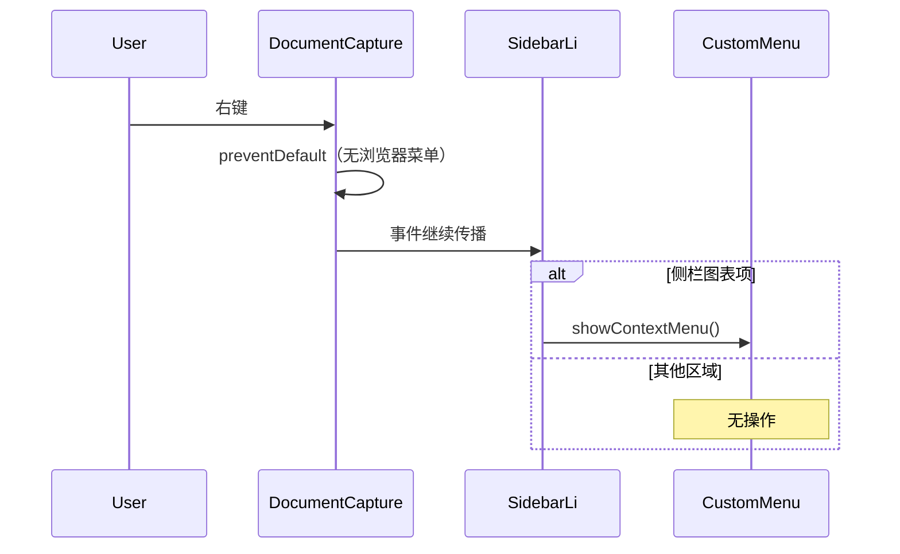

# 全站禁用浏览器原生右键菜单

## 目标

用户选择 **整个站点** 范围：禁止浏览器默认右键菜单（如「检查」「另存为图片」等），同时 **不破坏** 现有侧栏图表自定义菜单（[`public/diagrams.js`](public/diagrams.js) 中 `#diagram-context-menu`）。

## 行为说明

| 区域 | 浏览器右键 | 应用内功能 |
|------|-----------|-----------|
| 预览区 / 编辑器 / 工具栏 | 禁用 | 键盘复制粘贴、工具栏 Copy/Download 仍可用 |
| 侧栏图表列表项 | 禁用浏览器菜单 | 自定义菜单（重命名等）仍通过 `contextmenu` 事件触发 |
| 分享页 `/view/...` | 禁用 | 只读预览，无自定义菜单 |

**注意**：`preventDefault()` 只能挡住原生菜单，不能防止 DevTools、地址栏、或工具栏 Download SVG。这是 UX 层限制，不是内容保护。

## 实现方式

在 **捕获阶段** 对 `document` 监听 `contextmenu` 并 `preventDefault()`：

```js
document.addEventListener('contextmenu', (event) => {
  event.preventDefault();
}, { capture: true });
```

捕获阶段统一拦截默认行为；事件仍会冒泡到侧栏 `li` 的处理器，自定义菜单逻辑不变（见 [`diagrams.js` 310–314 行](public/diagrams.js)）。



## 修改文件

### 1. [`public/app.js`](public/app.js)

在 `init()` 开头（DOM 已就绪、模块加载后）添加上述监听器。约 3 行，无需新文件。

### 2. [`src/worker.js`](src/worker.js) — `viewPageHtml()`

分享页是独立内联 HTML（约 60–140 行），不加载 `app.js`。在 `viewPageHtml` 的内联 `<script type="module">` 末尾加入同样的 `contextmenu` 拦截，保证 `/view/:user/:id` 与带文件夹路径的分享页行为一致。

## 不改动

- [`public/index.html`](public/index.html)：不必加 `oncontextmenu` 内联属性，逻辑集中在 JS 更易维护
- [`public/diagrams.js`](public/diagrams.js)：现有自定义菜单与「点击外部关闭」逻辑无需修改
- CSS `user-select`：未要求，暂不添加

## 验证清单

1. 预览区右键 → 无浏览器菜单；滚轮缩放、拖拽平移、双击改标签仍正常
2. CodeMirror 编辑器右键 → 无浏览器菜单；Ctrl+C / Ctrl+V 仍可用
3. 侧栏图表项右键 → 出现「重命名 / 复制 / 移动到 / 删除」自定义菜单
4. 自定义菜单打开时，在空白处右键 → 菜单关闭，仍无浏览器菜单
5. 打开 `/view/username/id` 分享页 → 预览区右键无浏览器菜单
