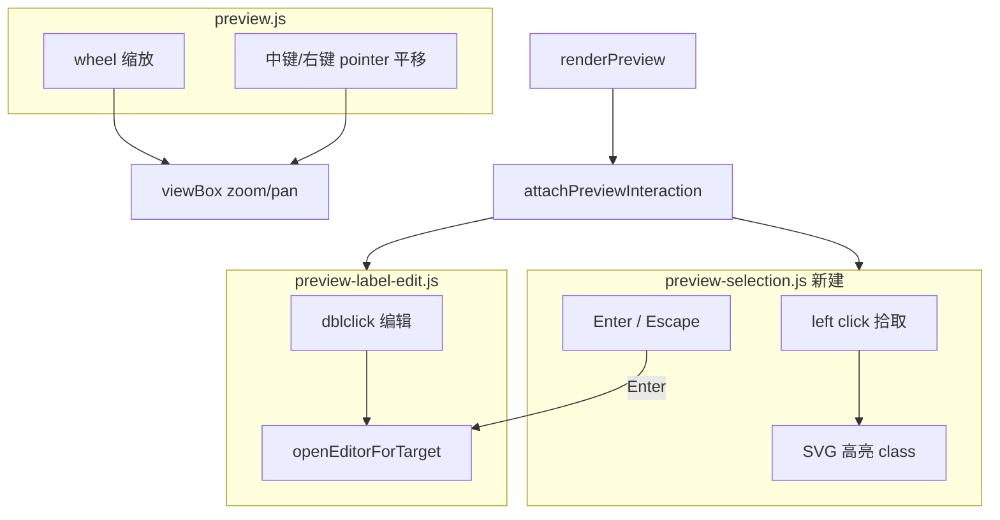

# 预览交互改造

## 目标映射

| 输入 | 当前行为 | 新行为 |
|------|----------|--------|
| 滚轮 | 需 Ctrl/Meta + 滚轮才缩放 | **直接滚轮缩放**（以指针位置为锚点） |
| 左键拖拽 | 平移 | **取消**；改为 **单击拾取**（高亮节点/边/集群等） |
| 左键双击 | 打开标签编辑 | **保留** |
| 选中 + Enter | 无 | **打开标签编辑**（与双击等价） |
| 右键拖拽 | 无（且全站禁原生菜单） | **平移** |
| 中键拖拽 | 无 | **平移** |
| 触摸 | 双指 pinch 缩放 | **不变**（MVP 不增加单指平移） |

与 [全站禁用右键](public/app.js) 不冲突：平移走 `pointerdown/move/up`（`button === 1|2`），不依赖 `contextmenu`；全站 `preventDefault` 正好避免右键菜单干扰拖拽。

---

## 架构



---

## 1. 修改 [`public/preview.js`](public/preview.js)

### 滚轮

```js
preview.addEventListener('wheel', (event) => {
  if (!getPreviewSvg()) return;
  event.preventDefault(); // 去掉 ctrlKey/metaKey 判断
  const point = getPreviewPoint(event.clientX, event.clientY);
  const factor = event.deltaY < 0 ? 1.1 : 1 / 1.1;
  zoomPreviewBy(factor, point.x, point.y);
}, { passive: false });
```

### 平移（中键 + 右键）

- `pointerdown`：`button === 1 || button === 2` 时启动平移
- `event.preventDefault()` 阻止中键自动滚动
- 复用现有 `previewPanning` / `panPreviewBy` / `setPointerCapture`
- **移除** `button === 0` 的平移逻辑
- 平移阈值：移动超过 ~3px 才视为 drag，避免误触（右键按下未移动时不影响后续 click 拾取——右键无 click 拾取需求）

### 挂载交互

`renderPreview` 成功后调用新函数 `attachPreviewInteraction(svg, preview, handlers)`，替代仅 `attachLabelEditing`。

---

## 2. 新建 [`public/preview-selection.js`](public/preview-selection.js)

职责：拾取与高亮，**不**包含 patch/编辑逻辑。

**解析拾取目标**（自 `event.target` 向上遍历 SVG）：

| Mermaid 元素 | 选择容器 | 说明 |
|--------------|----------|------|
| 节点 | `g.node` | flowchart/state/class 等 |
| 边 | `g.edgePath` 或 `.flowchart-link` 父级 | 尽量选中整条边 |
| 子图 | `g.cluster` | subgraph |
| 序列图参与者 | `.actor` / `.participant` | 可选 P0 |
| 空白 | — | 清除选中 |

**状态**：

```js
let selectedEl = null; // 当前选中的 SVG 容器元素
```

**行为**：

- `pointerup` on svg（`button === 0`，且移动距离 < 阈值）：`selectElement(target)` 或 `clearSelection()`
- 给选中元素加 class `is-preview-selected`（render 时需 `detach` 清理）
- `Escape`：清除选中
- `Enter`：若已有选中且可解析为标签目标 → 调用 `preview-label-edit` 的 `openEditorForTarget`
- 导出：`attachSelection` / `detachSelection` / `getSelectedElement`

**高亮样式**（[`public/style.css`](public/style.css)）：

```css
#preview-canvas svg .is-preview-selected > rect,
#preview-canvas svg .is-preview-selected > polygon,
#preview-canvas svg .is-preview-selected > path,
#preview-canvas svg .is-preview-selected > circle {
  stroke: var(--accent);
  stroke-width: 2px;
  filter: drop-shadow(0 0 4px rgba(0, 122, 204, 0.5));
}
```

边/集群用 `outline` 或 stroke 增强，按元素类型微调。

---

## 3. 修改 [`public/preview-label-edit.js`](public/preview-label-edit.js)

- 抽取 **`buildLabelMeta(containerEl, svg)`**：从已选/双击目标生成 `{ kind, nodeKey, oldText, labelRect, containerEl }`（复用现有 `resolveLabelTarget` / `findLabelContainer`）
- 导出 **`openEditorForTarget(svg, previewEl, targetEl, handlers)`** 供 Enter 与 dblclick 共用
- `dblclick`  handler 改为调用 `openEditorForTarget`（不再重复逻辑）
- 编辑进行中仍通过 `isLabelEditBlockingPan()` 阻止平移
- **平移进行中**不触发拾取（`preview.js` 暴露 `isPreviewPanning()` 或在 selection 模块读共享 flag）

---

## 4. 修改 [`public/style.css`](public/style.css)

| 选择器 | 变更 |
|--------|------|
| `#preview.preview-viewport` | `cursor: default`（去掉默认 `grab`） |
| `#preview.preview-viewport.is-panning` | 保持 `grabbing` |
| `#preview-canvas svg .node, .edgePath, .cluster, ...` | `cursor: pointer` 提示可拾取 |
| `.is-preview-selected` | 高亮规则（见上） |
| `.is-editing-label` | 保持现有，编辑时 cursor 不变 |

---

## 5. 不改动 / 注意事项

- [`public/app.js`](public/app.js) 全站 `contextmenu` 拦截：**不改**；右键平移不依赖 contextmenu
- 工具栏 Zoom 按钮、Fit/1:1：**不变**
- 自动保存、三种 workbench 模式：**不变**
- 拾取暂不支持 **多选**、**属性面板**（后续 P2）

---

## 验证清单

1. 滚轮（无 Ctrl）：以鼠标位置缩放；预览区不滚动页面
2. 右键/中键拖拽：平移；不出现浏览器菜单（仍被全站拦截）
3. 左键拖拽：不平移
4. 左键单击节点/边/子图：高亮；点空白取消
5. 双击标签：仍打开 inline 编辑并回写源码
6. 选中节点后 Enter：打开编辑；Escape 取消选中
7. 平移/编辑进行中互不干扰；re-render 后选中态清除
8. 触摸双指 pinch 缩放仍正常

---

## 涉及文件

| 文件 | 操作 |
|------|------|
| [`public/preview.js`](public/preview.js) | 改 wheel/pointer 平移逻辑；集成 attach |
| [`public/preview-selection.js`](public/preview-selection.js) | **新建** 拾取与高亮 |
| [`public/preview-label-edit.js`](public/preview-label-edit.js) | 抽取 openEditorForTarget；Enter 复用 |
| [`public/style.css`](public/style.css) | cursor + 选中高亮 |
