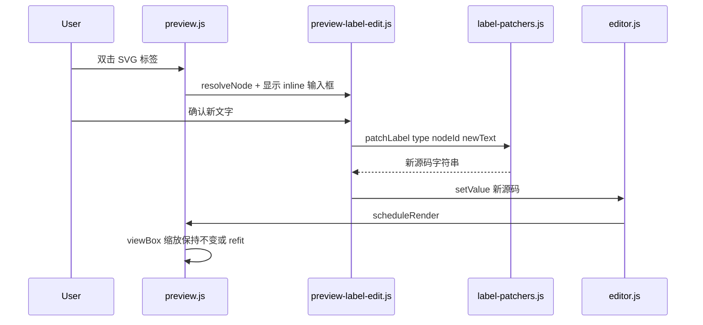

# 预览矢量缩放 + 标签编辑同步源码

## 目标

1. **矢量缩放**：放大预览不再模糊（去掉 CSS `scale` 栅格化）
2. **标签编辑**：预览中双击节点/标签文字 → 修改后 **同步更新左侧源码** → 触发 re-render → autosave

你已选择：**仅改标签文字**（非拖拽拓扑），且希望 **覆盖全部 Mermaid 类型**（分阶段落地）。

## 架构总览




---

## Part A：矢量预览（viewBox pan/zoom）

与 [原矢量预览计划](c:\Users\odoka.cursor\plans\矢量预览缩放_0dc109a9.plan.md) 一致，核心变更：


| 现状                                         | 目标                          |
| ------------------------------------------ | --------------------------- |
| `#preview-canvas` CSS `transform: scale()` | 改 SVG `viewBox` 实现 pan/zoom |
| `will-change: transform` 促栅格化              | 移除；SVG `width/height: 100%` |


**改动文件**：`[public/preview.js](public/preview.js)`、`[public/style.css](public/style.css)`

**状态变量**：`baseViewBox`、`currentViewBox`；`previewScale = base.width / current.width` 供 zoom 标签显示。

**交互保留**：Fit / 1:1 / ± / Ctrl+滚轮 / 拖拽 / 双指捏合；re-render 后默认 Fit。

---

## Part B：预览标签编辑 → 同步源码

### 交互设计

- **双击** 预览区内节点标签（`foreignObject` 内文字或 SVG `text`）进入编辑
- 在标签位置显示 **inline 输入框**（`contenteditable` 或 `<input>`），Enter 提交、Esc 取消
- **单击拖拽** 仍为平移（与双击不冲突）
- 提交后：patch 源码 → `ctx.editor.setValue`（已有 `addToHistory: false`）→ `markContentDirty` + `scheduleRender`
- 状态栏提示「已更新源码」；patch 失败则提示「此元素暂不支持预览编辑」

### 新增模块

#### `[public/preview-label-edit.js](public/preview-label-edit.js)`（新建）

- `attachLabelEditing(svg, { getSource, setSource, showStatus })`
- `resolveLabelTarget(event)`：从点击目标向上找 Mermaid 节点容器
  - flowchart：`g.node` / `g.cluster`（subgraph 标题）
  - 通用：含 `id` 且匹配 Mermaid 生成模式的 `g` 元素
- 读取当前显示文字：`foreignObject` 内 `textContent` 或 `text/tspan`
- 解析 **nodeKey**：从 SVG `id`（如 `flowchart-A-0`）或 `data-et="node"` / class 提取
- 编辑完成后调用 patcher，再 `setSource(newCode)`

#### `[public/label-patchers.js](public/label-patchers.js)`（新建）

按图表类型注册 patch 函数：

```javascript
export function patchLabel(type, source, { nodeKey, oldText, newText }) {
  const patcher = PATCHERS[type];
  if (!patcher) return null;
  return patcher(source, { nodeKey, oldText, newText });
}
```

**分阶段支持（全部类型，迭代交付）**：


| 优先级 | 类型                                                                            | patch 策略                                                            |
| --- | ----------------------------------------------------------------------------- | ------------------------------------------------------------------- |
| P0  | `flowchart` / `graph`                                                         | 替换 `nodeKey[...]` / `(...)` / `{...}` / `[["..."]]` 内标签；subgraph 标题 |
| P0  | `pie`                                                                         | `title` 与 `"label" : value`                                         |
| P1  | `sequenceDiagram`                                                             | `participant X as Label`；`A->>B: message` 消息文字（按 nodeKey 区分）        |
| P1  | `classDiagram`                                                                | `class Name` 显示名、`Note for` 等                                       |
| P1  | `stateDiagram` / `stateDiagram-v2`                                            | state 描述 `: label`                                                  |
| P2  | `erDiagram`                                                                   | 实体块内属性行（仅属性 text，不改实体名）                                             |
| P2  | `gantt` / `journey` / `timeline`                                              | section / task / 条目 title                                           |
| P2  | `mindmap` / `quadrantChart` / `requirementDiagram` / `C4Context` / `gitGraph` | 各类型专用正则 + 行级替换                                                      |


实现要点：

- 先 `stripLayoutFrontmatter`（复用 `[public/layout.js](public/layout.js)` 的 split 逻辑）只对 **body** patch，再拼回 frontmatter
- 替换时保留引号风格（有 `"` 则继续用 quoted；含 `]`、`:` 等必须 quote）
- **nodeKey 与 oldText 双校验**，避免误改同名文本

可选增强：调用 `mermaid.mermaidAPI.getDiagramFromText(code)`（若 CDN 版可用）校验 nodeKey，减少纯 regex 误匹配。

### 与现有代码集成


| 文件                                       | 变更                                                                                 |
| ---------------------------------------- | ---------------------------------------------------------------------------------- |
| `[public/preview.js](public/preview.js)` | `renderPreview` 成功后 `attachLabelEditing`；导出 `getViewBox` 供 overlay 定位              |
| `[public/app.js](public/app.js)`         | 传入 `setSource: (code) => { suppress; editor.setValue; markDirty; scheduleRender }` |
| `[public/style.css](public/style.css)`   | `.preview-label-editor` 浮动输入框样式；`.preview-viewport.is-editing-label` 临时禁用 pan      |


### 矢量缩放 + 标签编辑协调

- inline 编辑器位置：用 `getBoundingClientRect()` 相对 `#preview` 定位（viewBox 缩放下 DOM 矩形已含正确映射）
- 编辑进行中暂停 pointer panning
- re-render 后若仍在编辑同一 nodeKey，可尝试恢复输入框（首版可简化为关闭 overlay）

---

## 不改动的部分

- Issue 存储、autosave debounce、分享页
- 不做：拖拽改布局、增删边、改节点 ID

## 测试计划

**矢量**

1. 放大 400% 线条清晰；Fit/滚轮/拖拽正常

**标签编辑**
2. flowchart：双击 `A[Old]` 改为 `New`，左侧变为 `A[New]`，预览更新
3. 含 `<br/>` 的标签（example.mmd）改为单行或保留转义策略
4. sequence / pie / class 各测 1 例（P1 完成后）
5. 不支持的元素双击 → 友好提示，不改源码
6. 编辑后 autosave 仍触发；撤销键只撤销编辑器内键盘输入，不撤销预览触发的整篇 setValue（与现 setValue 行为一致）

## 风险

- **全类型覆盖**：语法差异大，采用 patcher 注册表 **分 PR/阶段** 交付；未注册类型返回 null
- **重复标签文本**：靠 nodeKey + 上下文行定位，极端情况可能 patch 失败并提示手动改源码
- **foreignObject HTML 标签**：Mermaid 用 HTML 渲染多行文字，编辑框提交时需决定写回 `\n` 还是 `<br/>`（flowchart 建议写 `\n`，与 Mermaid 源码一致）

## 主要文件

- 修改：`[public/preview.js](public/preview.js)`、`[public/style.css](public/style.css)`、`[public/app.js](public/app.js)`
- 新增：`[public/preview-label-edit.js](public/preview-label-edit.js)`、`[public/label-patchers.js](public/label-patchers.js)`

